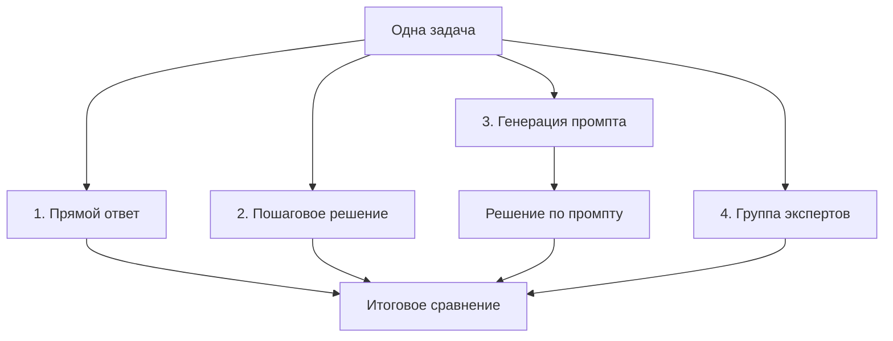

# День 3 — разные способы рассуждения

Третье практическое задание курса AI Advent посвящено тому, как формулировка промпта влияет на рассуждение и итоговый ответ языковой модели.

Одна логическая задача решается через Groq API четырьмя способами. После этого модель сравнивает полученные ответы с проверяемым эталоном.

## Задание

Необходимо решить одну задачу через API четырьмя способами:

1. Получить прямой ответ без дополнительных инструкций.
2. Добавить в промпт инструкцию `Решай пошагово`.
3. Попросить модель сначала составить промпт для решения задачи, а затем использовать его.
4. Создать в промпте группу экспертов и получить решение от каждого.

В конце необходимо сравнить ответы и определить, какой способ дал наиболее точный результат.

## Выбранная задача

Четырём исследователям нужно ночью перейти мост. Они переходят его за 1, 2, 7 и 10 минут соответственно.

Условия:

- на мосту могут одновременно находиться не более двух человек;
- у группы есть только один фонарь;
- без фонаря переходить мост нельзя;
- когда идут двое, они движутся со скоростью более медленного участника.

Нужно найти минимальное время, за которое вся группа перейдёт мост.

Задача подходит для сравнения, потому что требует нескольких связанных действий, допускает разные стратегии и имеет проверяемый правильный ответ — **17 минут**.

## Схема программы



## Способы решения

### 1. Прямой ответ

Модель получает только условие задачи:

```python
direct_answer = get_response(TASK)
```

Дополнительных указаний о способе решения нет. Модель самостоятельно выбирает глубину и формат ответа.

### 2. Пошаговое решение

К условию добавляется явная инструкция:

```python
step_by_step_answer = get_response(
    f"{TASK}\n\nРешай пошагово. Проверь итоговый ответ."
)
```

Этот способ просит показать последовательность переходов, вычисления и проверку результата.

### 3. Промпт, составленный моделью

Сначала модель получает метазадачу: подготовить хороший промпт для решения исходной задачи.

```python
generated_prompt = get_response(
    "Составь точный и понятный промпт для решения следующей "
    "логической задачи..."
)
```

Затем созданный текст отправляется модели как новый пользовательский запрос:

```python
generated_prompt_answer = get_response(generated_prompt)
```

Поэтому третий способ состоит из двух API-вызовов:

1. Создание промпта.
2. Решение задачи по созданному промпту.

### 4. Группа экспертов

В одном промпте создаются три роли:

| Эксперт | Задача |
|---|---|
| Аналитик | Рассмотреть возможные стратегии и выбрать лучшую |
| Инженер | Расписать маршрут и проверить вычисления |
| Критик | Найти ошибки и проверить, доказана ли минимальность |

Это не три отдельные модели и не настоящая мультиагентная система. Одна модель последовательно имитирует три точки зрения внутри одного ответа.

## Итоговое сравнение

После получения четырёх решений выполняется отдельный запрос для их оценки.

Оценщик получает:

- все четыре ответа;
- эталонный результат — 17 минут;
- правильную последовательность переходов;
- критерии оценки: правильность, ясность и проверка минимальности.

Эталон не передаётся на этапах решения. Он появляется только в финальном запросе и поэтому не подсказывает первоначальный ответ.

## Количество запросов

| Этап | API-вызовы |
|---|---:|
| Прямой ответ | 1 |
| Пошаговое решение | 1 |
| Создание промпта | 1 |
| Решение по созданному промпту | 1 |
| Группа экспертов | 1 |
| Итоговое сравнение | 1 |
| **Всего** | **6** |

Четыре способа решения требуют пяти запросов, поскольку третий способ состоит из двух этапов. Шестой запрос используется только для сравнения.

## Основные части кода

### Константы

В начале файла находятся общие настройки:

```python
MODEL = "openai/gpt-oss-20b"
MAX_COMPLETION_TOKENS = 2048
RATE_LIMIT_WAIT_SECONDS = 60
```

- `MODEL` определяет используемую модель;
- `MAX_COMPLETION_TOKENS` ограничивает максимальную генерацию одного ответа;
- `RATE_LIMIT_WAIT_SECONDS` задаёт паузу перед повторным запросом.

### `get_response()`

Функция принимает пользовательский промпт, отправляет его модели и возвращает текст ответа:

```python
def get_response(user_prompt: str) -> str:
```

Все способы используют одну функцию и одинаковые параметры API. Благодаря этому сравнивается именно влияние промпта, а не разных настроек модели.

### `print_section()`

Функция печатает заголовок, разделители и содержимое отдельного этапа:

```python
def print_section(title: str, content: str) -> None:
```

Она не обращается к API и нужна только для читаемого вывода в консоль.

### `main()`

Главная функция последовательно запускает все способы решения, сохраняет ответы в переменные и передаёт их финальному оценщику.

Код в `main.py` содержит подробные комментарии на русском языке. Они объясняют назначение импортов, констант, параметров API, условий, циклов и каждого этапа эксперимента.

## Параметры модели

Во всех запросах используются одинаковые настройки:

```python
temperature=0.2
reasoning_effort="low"
max_completion_tokens=MAX_COMPLETION_TOKENS
```

### `temperature=0.2`

Низкая температура уменьшает случайность. Для логической задачи важнее стабильность вычислений, чем разнообразие формулировок.

### `reasoning_effort="low"`

Модель использует небольшое количество внутренних reasoning-токенов. Пошаговый способ при этом всё равно получает явную инструкцию показать этапы решения в видимом ответе.

Значение `low` также уменьшает вероятность ситуации, когда весь доступный лимит будет потрачен на внутреннее рассуждение, а `message.content` останется пустым.

### `max_completion_tokens=2048`

Параметр задаёт верхнюю границу количества токенов, которые модель может использовать при формировании ответа, включая внутреннее рассуждение reasoning-модели.

Лимит выбран с учётом ограничения аккаунта Groq в 8000 токенов в минуту. Значение 8192 использовать нельзя: вместе с входным промптом оно превышает доступный TPM ещё до генерации ответа.

## Обработка ограничения TPM

Программа делает шесть запросов подряд, поэтому даже с лимитом 2048 может временно исчерпать доступное количество токенов в минуту.

Если Groq возвращает статус `413` или `429` с кодом `rate_limit_exceeded`, функция:

1. Выводит предупреждение.
2. Ждёт 60 секунд.
3. Повторяет запрос один раз.

```python
if not is_rate_limit_error or attempt == 1:
    raise

print(
    "\nДостигнут лимит Groq API. "
    f"Повторный запрос через {RATE_LIMIT_WAIT_SECONDS} секунд..."
)

time.sleep(RATE_LIMIT_WAIT_SECONDS)
```

Неизвестные ошибки не скрываются и передаются во внешний обработчик.

## Правильное решение

Минимальное время — **17 минут**:

```text
1 и 2 переходят: 2 минуты
1 возвращается: 1 минута
7 и 10 переходят: 10 минут
2 возвращается: 2 минуты
1 и 2 переходят: 2 минуты

Итого: 2 + 1 + 10 + 2 + 2 = 17 минут
```

## Подготовка к запуску

Выполните общую [настройку проекта](../README.md#подготовка-проекта) и добавьте `GROQ_API_KEY` в корневой файл `.env`.

## Запуск

Из корня репозитория выполните:

```bash
python day-03-reasoning-methods/main.py
```

Ввод пользователя не требуется. Программа последовательно выведет условие, четыре решения и итоговое сравнение, после чего завершит работу.

Если будет достигнут минутный лимит Groq, выполнение продолжится автоматически после указанной паузы.

## Результат эксперимента

Точное содержание ответов может меняться между запусками. Поэтому лучший способ определяется не заранее, а по фактическим результатам и проверяемым критериям.

Обычно способы отличаются следующим образом:

| Способ | Ожидаемая особенность |
|---|---|
| Прямой ответ | Краткое решение с минимальным объяснением |
| Пошаговый | Понятная последовательность действий и вычислений |
| Созданный промпт | Более формализованные требования к решению и проверке |
| Группа экспертов | Рассмотрение стратегии, вычислений и возможных ошибок |

Больший объём ответа сам по себе не означает большую точность. Главные критерии — правильный результат, корректный маршрут и обоснование минимальности.

## Итог третьего дня

Эксперимент показывает, что одна и та же модель с одинаковыми настройками может давать разные по структуре и убедительности ответы в зависимости от формулировки промпта.

Универсально лучшего способа нет: прямой запрос подходит для простых задач, пошаговая инструкция делает решение прозрачнее, создание отдельного промпта помогает сформулировать требования, а группа экспертов добавляет проверку с нескольких точек зрения.

## Полезные ссылки

- [Groq: Text Generation](https://console.groq.com/docs/text-chat)
- [Groq: Prompting](https://console.groq.com/docs/prompting)
- [Groq: Reasoning](https://console.groq.com/docs/reasoning)
- [Groq API Reference](https://console.groq.com/docs/api-reference)
