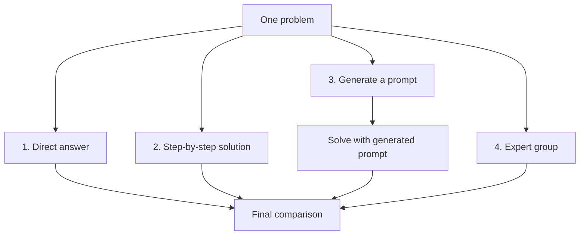

**English** | [Русский](README.ru.md)

# Day 3 — Reasoning Strategies

The third AI Advent assignment explores how prompt formulation affects a model's reasoning and final answer.

One logic problem is solved through the Groq API using four approaches. A final model call then compares all responses against a verifiable reference answer.

## Assignment

Solve the same problem in four ways:

1. Request a direct answer without additional instructions.
2. Add a step-by-step instruction.
3. Ask the model to create a solution prompt, then use that prompt.
4. Simulate a group of experts in one prompt.

Finally, compare the responses and determine which approach produced the most accurate result.

## Selected Problem

Four researchers must cross a bridge at night. Their crossing times are 1, 2, 7, and 10 minutes.

Rules:

- no more than two people may be on the bridge at once;
- the group has one flashlight;
- nobody can cross without the flashlight;
- a pair moves at the speed of its slower member.

The goal is to find the minimum time required for everyone to cross.

This problem works well for comparison because it requires several related decisions, supports multiple strategies, and has a verifiable answer: **17 minutes**.

## Program Flow



## Reasoning Approaches

### 1. Direct answer

The model receives only the problem statement:

```python
direct_answer = get_response(TASK)
```

No solution strategy is prescribed. The model chooses the depth and format itself.

### 2. Step-by-step solution

An explicit instruction is appended to the problem:

```python
step_by_step_answer = get_response(
    f"{TASK}\n\nРешай пошагово. Проверь итоговый ответ."
)
```

This approach requests a visible sequence of crossings, calculations, and a final verification.

### 3. Model-generated prompt

The model first receives a meta-task: create a clear prompt for solving the original problem.

```python
generated_prompt = get_response(
    "Составь точный и понятный промпт для решения следующей "
    "логической задачи..."
)
```

The generated text is then sent back as a new user request:

```python
generated_prompt_answer = get_response(generated_prompt)
```

This approach requires two API calls:

1. Generate the prompt.
2. Solve the problem using that prompt.

### 4. Expert group

One prompt defines three virtual roles:

| Expert | Responsibility |
|---|---|
| Analyst | Explore possible strategies and select the best one |
| Engineer | List the crossings and verify the calculations |
| Critic | Find mistakes and check whether minimality was proven |

This is not a real multi-agent system and does not use three separate models. One model sequentially simulates three perspectives in a single response.

## Final Comparison

After the four solutions are generated, a separate request evaluates them.

The evaluator receives:

- all four responses;
- the correct result of 17 minutes;
- the correct crossing sequence;
- evaluation criteria: correctness, clarity, and proof of minimality.

The reference answer is not included in any solution request. It appears only during evaluation, so it cannot reveal the answer to the original attempts.

## Number of API Calls

| Stage | API calls |
|---|---:|
| Direct answer | 1 |
| Step-by-step solution | 1 |
| Prompt generation | 1 |
| Solution with generated prompt | 1 |
| Expert group | 1 |
| Final comparison | 1 |
| **Total** | **6** |

Four approaches require five requests because the third approach has two stages. The sixth request is used only for evaluation.

## Main Code Components

### Constants

```python
MODEL = "openai/gpt-oss-20b"
MAX_COMPLETION_TOKENS = 2048
RATE_LIMIT_WAIT_SECONDS = 60
```

- `MODEL` selects the model;
- `MAX_COMPLETION_TOKENS` limits one generation;
- `RATE_LIMIT_WAIT_SECONDS` defines the retry delay.

### `get_response()`

```python
def get_response(user_prompt: str) -> str:
```

All approaches use the same function and API parameters. This isolates the prompt as the variable being tested.

### `print_section()`

```python
def print_section(title: str, content: str) -> None:
```

This helper formats console output and does not call the API.

### `main()`

The main function runs all approaches in sequence, stores their responses, and sends them to the final evaluator.

The source file contains detailed Russian comments explaining imports, constants, parameters, conditions, loops, and experiment stages.

## Model Parameters

Every request uses:

```python
temperature=0.2
reasoning_effort="low"
max_completion_tokens=MAX_COMPLETION_TOKENS
```

### `temperature=0.2`

A low temperature reduces randomness. Stable calculations matter more than varied wording for this logic problem.

### `reasoning_effort="low"`

The model uses a smaller internal reasoning budget. The step-by-step variant still explicitly requests visible reasoning in the response.

The `low` value also reduces the chance that internal reasoning consumes the full budget and leaves `message.content` empty.

### `max_completion_tokens=2048`

This parameter limits the complete generation budget, including internal reasoning tokens.

The value respects the account's 8,000-token-per-minute limit. A value of 8,192 would exceed the available TPM when combined with the input prompt.

## TPM Limit Handling

Six sequential requests may exhaust the minute-level token allowance.

When Groq returns status `413` or `429` with `rate_limit_exceeded`, the program:

1. Prints a warning.
2. Waits for 60 seconds.
3. Retries once.

```python
if not is_rate_limit_error or attempt == 1:
    raise

print(
    "\nДостигнут лимит Groq API. "
    f"Повторный запрос через {RATE_LIMIT_WAIT_SECONDS} секунд..."
)

time.sleep(RATE_LIMIT_WAIT_SECONDS)
```

Unknown errors are not hidden and are propagated to the outer handler.

## Correct Solution

The minimum time is **17 minutes**:

```text
1 and 2 cross: 2 minutes
1 returns: 1 minute
7 and 10 cross: 10 minutes
2 returns: 2 minutes
1 and 2 cross: 2 minutes

Total: 2 + 1 + 10 + 2 + 2 = 17 minutes
```

## Setup and Run

Complete the shared [project setup](../README.md#project-setup), add `GROQ_API_KEY` to the root `.env` file, and run:

```bash
python day-03-reasoning-methods/main.py
```

No user input is required. The program prints the problem, four solutions, and the final comparison, then exits.

If the minute limit is reached, execution resumes automatically after the configured delay.

## Experiment Results

Exact responses may vary between runs. The best approach is therefore selected from actual results using verifiable criteria rather than assumed in advance.

| Approach | Expected characteristic |
|---|---|
| Direct answer | A concise solution with minimal explanation |
| Step-by-step | A clear sequence of actions and calculations |
| Generated prompt | More formal requirements for solving and verification |
| Expert group | Strategy, calculation, and error-checking perspectives |

A longer response is not automatically more accurate. The important criteria are the correct total, a valid crossing sequence, and a justification of minimality.

## Day 3 Takeaway

The same model with identical API settings can produce answers with different structure and persuasiveness depending on prompt formulation.

There is no universally best approach. Direct prompting suits simple tasks, step-by-step instructions improve transparency, prompt generation helps formalize requirements, and expert simulation adds multiple review perspectives.

## Useful Links

- [Groq: Text Generation](https://console.groq.com/docs/text-chat)
- [Groq: Prompting](https://console.groq.com/docs/prompting)
- [Groq: Reasoning](https://console.groq.com/docs/reasoning)
- [Groq API Reference](https://console.groq.com/docs/api-reference)
