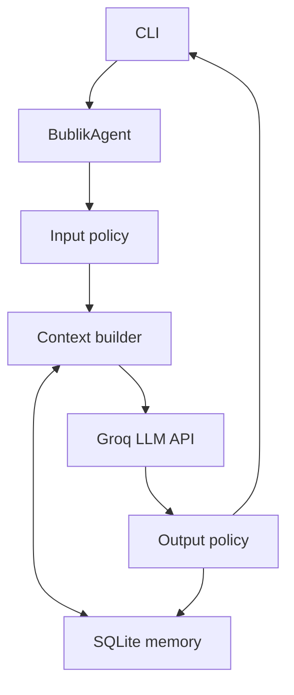

**English** | [Русский](README.ru.md)

# Day 6 — First Agent

The sixth AI Advent assignment turns the previously explored LLM API mechanisms into a separate agent entity.

The result is **Bublik**, an autonomous onboard computer of a research spacecraft on a long expedition to distant galaxies. The user is **Cheburator**, the captain and leader of the research mission.

Unlike a direct API call placed inside the console loop, `BublikAgent` owns the complete request-response workflow: it validates input, restores conversation context, calls the LLM, validates the output, and saves the result.

## Assignment

Build a simple agent that:

- accepts a user request;
- sends it to an LLM through an API;
- receives the response;
- displays the result in a CLI, web interface, or another simple interface.

The agent must be a separate entity. Its request and response logic must be encapsulated inside it rather than implemented as a single API call in the interface.

## Result

The program implements an interactive CLI with a separate `BublikAgent` class and persistent conversation history stored in a local SQLite database.

The agent:

- receives the captain's request from the CLI;
- applies an input policy;
- loads recent mission history from SQLite;
- builds the LLM context;
- calls `openai/gpt-oss-20b` through the Groq API;
- applies an output policy;
- saves the request and response;
- returns the final response to the CLI.

## Story

The research spacecraft is conducting a long expedition across distant galaxies.

- **Cheburator** is the captain and mission leader.
- **Bublik** is the ship's autonomous onboard computer.
- Their mission is to explore unknown planets, cosmic phenomena, detected signals, and possible risks.

Bublik must distinguish known data from assumptions. When available information is insufficient, it should say so and suggest what additional data the crew needs to collect.

## Project Structure

```text
day-06-first-agent/
├── agent.py
├── main.py
├── memory.py
├── README.md
├── README.ru.md
└── data/
    └── bublik.db
```

- `main.py` contains only the CLI, dependency creation, and command processing;
- `agent.py` contains `BublikAgent`, its prompt, policies, context assembly, and LLM call;
- `memory.py` contains the SQLite repository and the persistent message model;
- `data/bublik.db` is created automatically during the first run and is excluded from Git.

## Architecture



The CLI does not know how the Groq request is built or how history is stored. It uses the public agent contract:

```python
response = agent.process(user_input)
```

This separation allows the CLI to be replaced later with a REST API or web interface without rewriting the agent logic.

## Agent Lifecycle

For every user request, the agent performs the following sequence:

1. Removes surrounding whitespace and rejects an empty request.
2. Saves the user request with the `pending` status.
3. Loads the most recent successful messages from SQLite.
4. Adds the system prompt and current request to the context.
5. Sends the context to the Groq API.
6. Rejects an empty model response.
7. Changes the user request status to `completed`.
8. Saves the assistant response with the `completed` status.
9. Returns the response to the console.

If the API call fails, the user request is marked as `failed`. It remains in the mission log but is excluded from future LLM context.

## Agent as a Separate Entity

The main requirement of Day 6 is implemented by `BublikAgent`:

```python
class BublikAgent:
    def process(self, user_input: str) -> str:
        ...
```

The class encapsulates:

- input validation;
- context construction;
- conversation memory access;
- model configuration;
- Groq API communication;
- output validation;
- success and failure persistence.

The console is responsible only for reading input, recognizing commands, calling the agent, and printing the result.

## Input and Output Policies

The first version uses two small deterministic policies.

### Input policy

```python
prepared_input = user_input.strip()

if not prepared_input:
    raise AgentError("Запрос не может быть пустым")
```

It removes unnecessary whitespace and prevents empty requests from reaching the API.

### Output policy

```python
prepared_response = response.strip()

if not prepared_response:
    raise AgentError("Модель вернула пустой ответ")
```

It normalizes the model response and prevents an empty result from being stored as a successful answer.

These policies are intentionally simple. More advanced validation and a judge can be added later without changing the CLI.

## Persistent Memory

Day 1 stored history only in a Python list. That history disappeared after the program stopped.

Day 6 uses SQLite from the Python standard library:

```python
import sqlite3
```

No additional database dependency is required.

The database contains two tables:

```text
conversations
└── one long research expedition

messages
├── user requests
├── assistant responses
├── processing status
└── creation time
```

Message statuses:

| Status | Meaning |
|---|---|
| `pending` | The request was saved and is currently being processed |
| `completed` | The request or response belongs to a successful exchange |
| `failed` | The request could not be processed by the LLM |

The complete history remains in SQLite, while only the latest 20 completed messages are added to each LLM request. This is the first basic context-management rule and prevents the prompt from growing without an immediate limit.

## Model Configuration

The agent currently uses:

```python
model="openai/gpt-oss-20b"
temperature=0.7
reasoning_effort="low"
max_completion_tokens=1200
```

- `temperature=0.7` provides a balance between stable and varied responses;
- `reasoning_effort="low"` reduces reasoning-token usage;
- `max_completion_tokens=1200` limits the maximum generation size.

The model and context limit are constructor parameters, so they can be changed without modifying the CLI.

## CLI Commands

| Command | Action |
|---|---|
| `/history` | Displays the latest saved mission messages |
| `/exit` | Ends the session |
| `выход` | Ends the session using the Russian command |

Closing the program does not delete the database. The next run continues the same expedition.

## Setup

Complete the shared [project setup](../README.md#project-setup) and add `GROQ_API_KEY` to the root `.env` file:

```env
GROQ_API_KEY=your_api_key_here
```

The existing dependencies are sufficient:

```text
groq
python-dotenv
```

SQLite is included with Python and must not be added to `requirements.txt`.

## Run

From the repository root:

```bash
python day-06-first-agent/main.py
```

The program displays:

```text
🤖 Бортовой компьютер исследовательского корабля «Бублик»
Экспедиция в дальние галактики продолжается.
Команды: /history — журнал, /exit — завершить сеанс.

Чебуратор:
```

## Persistence Test

Start a conversation and give Bublik a mission decision:

```text
Чебуратор: Главной целью назначаем поиск планеты с жидкой водой.
```

End the session:

```text
/exit
```

Run the program again and ask:

```text
Чебуратор: Какую главную цель исследования мы выбрали?
```

If Bublik recalls the search for a planet with liquid water, the SQLite history and context restoration are working correctly.

You can also inspect the stored messages through:

```text
/history
```

## Error Handling

The implementation handles:

- a missing `GROQ_API_KEY`;
- empty user input;
- empty model responses;
- Groq API failures;
- preservation of failed requests for diagnostics;
- exclusion of failed requests from later model context.

The database file is excluded through `.gitignore`:

```gitignore
*.db
*.db-shm
*.db-wal
```

This keeps local conversation history out of the public repository.

## Current Limitations

This first agent intentionally remains small:

- one predefined expedition is used;
- there is no authentication or multi-user support;
- context selection uses the latest completed messages only;
- there are no topic branches or vector embeddings yet;
- there is no self-reflective memory;
- there is no judge for response quality;
- the application is a local CLI rather than a REST service.

These are extension points rather than blockers for the Day 6 assignment.

## Next Steps

The architecture can later evolve with:

- layer-based memory;
- rule-based memory;
- topic branches;
- vector embeddings and semantic search;
- self-reflective memory;
- a memory judge;
- multiple LLM providers;
- a FastAPI REST service;
- PostgreSQL on a VPS;
- a web or mobile interface.

## Day 6 Takeaway

The LLM integration is no longer a direct API call inside the user interface. It is now encapsulated in a standalone agent with its own role, policies, context construction, error handling, and persistent memory.

Bublik has evolved from a chatbot into the onboard computer of a long-running research expedition.

