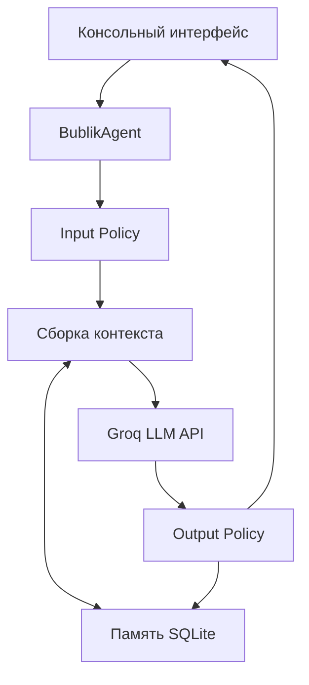

[English](README.md) | **Русский**

# День 6 — первый агент

Шестое практическое задание AI Advent объединяет изученные ранее механизмы работы с LLM API в отдельную сущность — агента.

Результатом стал **Бублик** — автономный бортовой компьютер исследовательского корабля, который находится в длительной экспедиции в дальних галактиках. Пользователь выступает в роли **Чебуратора**, капитана корабля и руководителя исследовательской миссии.

В отличие от прямого вызова API внутри консольного цикла, `BublikAgent` управляет всем процессом обработки запроса: проверяет ввод, восстанавливает контекст разговора, обращается к LLM, проверяет результат и сохраняет историю.

## Задание

Создать простого агента, который:

- принимает запрос пользователя;
- отправляет его в LLM через API;
- получает ответ;
- выводит результат в CLI, web или другом простом интерфейсе.

Агент должен быть отдельной сущностью. Логика запроса и ответа должна находиться внутри агента, а не быть одиночным вызовом API в пользовательском интерфейсе.

## Результат

Программа реализует интерактивный CLI, отдельный класс `BublikAgent` и постоянную историю диалога в локальной базе SQLite.

Агент:

- получает запрос капитана из CLI;
- применяет входную политику;
- загружает недавнюю историю экспедиции из SQLite;
- формирует контекст для модели;
- обращается к `openai/gpt-oss-20b` через Groq API;
- применяет выходную политику;
- сохраняет запрос и ответ;
- возвращает готовый результат в CLI.

## История

Исследовательский корабль находится в длительной экспедиции в дальних галактиках.

- **Чебуратор** — капитан и руководитель миссии.
- **Бублик** — автономный бортовой компьютер корабля.
- Цель экспедиции — исследование неизвестных планет, космических явлений, обнаруженных сигналов и возможных рисков.

Бублик должен отделять известные данные от предположений. Если информации недостаточно, он сообщает об этом и предлагает, какие дополнительные данные необходимо собрать экипажу.

## Структура

```text
day-06-first-agent/
├── agent.py
├── main.py
├── memory.py
├── README.md
├── README.ru.md
└── data/
    └── bublik.db
```

- `main.py` содержит CLI, создание зависимостей и обработку команд;
- `agent.py` содержит `BublikAgent`, системный промпт, политики, сбор контекста и вызов LLM;
- `memory.py` содержит SQLite-репозиторий и модель сохранённого сообщения;
- `data/bublik.db` автоматически создаётся при первом запуске и исключён из Git.

## Архитектура



CLI не знает, как формируется запрос Groq и как сохраняется история. Он использует публичный контракт агента:

```python
response = agent.process(user_input)
```

Благодаря этому консоль впоследствии можно заменить REST API или web-интерфейсом без переписывания внутренней логики агента.

## Жизненный цикл запроса

Для каждого сообщения пользователя агент выполняет следующую последовательность:

1. Удаляет пробелы по краям и отклоняет пустой запрос.
2. Сохраняет запрос пользователя со статусом `pending`.
3. Загружает последние успешные сообщения из SQLite.
4. Добавляет системный промпт и текущий запрос в контекст.
5. Отправляет контекст в Groq API.
6. Проверяет, что модель вернула непустой ответ.
7. Меняет статус запроса пользователя на `completed`.
8. Сохраняет ответ ассистента со статусом `completed`.
9. Возвращает готовый ответ в консоль.

Если вызов API завершается ошибкой, запрос получает статус `failed`. Он остаётся в журнале экспедиции, но не добавляется в последующий контекст LLM.

## Агент как отдельная сущность

Главное требование шестого дня реализовано через класс `BublikAgent`:

```python
class BublikAgent:
    def process(self, user_input: str) -> str:
        ...
```

Класс инкапсулирует:

- проверку входных данных;
- сбор контекста;
- взаимодействие с памятью;
- параметры модели;
- обращение к Groq API;
- проверку результата;
- сохранение успешного или неуспешного запроса.

Консоль отвечает только за чтение пользовательского ввода, распознавание команд, вызов агента и вывод результата.

## Input Policy и Output Policy

В первой версии используются две простые детерминированные политики.

### Input Policy

```python
prepared_input = user_input.strip()

if not prepared_input:
    raise AgentError("Запрос не может быть пустым")
```

Политика удаляет лишние пробелы и предотвращает отправку пустых запросов в API.

### Output Policy

```python
prepared_response = response.strip()

if not prepared_response:
    raise AgentError("Модель вернула пустой ответ")
```

Политика нормализует результат и не позволяет сохранить пустую строку как успешный ответ.

Эти проверки намеренно оставлены простыми. Более сложная валидация и отдельный Judge могут быть добавлены позже без изменения CLI.

## Постоянная память

В первом дне история хранилась только в списке Python и исчезала после завершения программы.

В шестом дне используется SQLite из стандартной библиотеки Python:

```python
import sqlite3
```

Устанавливать дополнительную зависимость для базы данных не требуется.

База содержит две таблицы:

```text
conversations
└── одна длительная исследовательская экспедиция

messages
├── запросы пользователя
├── ответы агента
├── статус обработки
└── время создания
```

Статусы сообщений:

| Статус | Значение |
|---|---|
| `pending` | Запрос сохранён и находится в обработке |
| `completed` | Запрос или ответ относится к успешному обмену |
| `failed` | Агент не смог обработать запрос через LLM |

Полная история остаётся в SQLite, однако в каждый новый запрос LLM добавляются только последние 20 завершённых сообщений. Это первое базовое правило управления контекстом, которое ограничивает рост промпта.

## Параметры модели

Сейчас агент использует:

```python
model="openai/gpt-oss-20b"
temperature=0.7
reasoning_effort="low"
max_completion_tokens=1200
```

- `temperature=0.7` создаёт баланс между стабильностью и вариативностью ответа;
- `reasoning_effort="low"` уменьшает расход reasoning-токенов;
- `max_completion_tokens=1200` ограничивает максимальный размер генерации.

Модель и количество сообщений контекста передаются через конструктор агента, поэтому могут быть изменены без редактирования CLI.

## Команды CLI

| Команда | Действие |
|---|---|
| `/history` | Показать последние сохранённые сообщения экспедиции |
| `/exit` | Завершить текущий сеанс |
| `выход` | Завершить сеанс русской командой |

Завершение программы не удаляет базу. После следующего запуска продолжается та же экспедиция.

## Подготовка

Выполните общую [настройку проекта](../README.ru.md#подготовка-проекта) и добавьте `GROQ_API_KEY` в корневой файл `.env`:

```env
GROQ_API_KEY=your_api_key_here
```

Существующих зависимостей достаточно:

```text
groq
python-dotenv
```

SQLite входит в Python, поэтому добавлять его в `requirements.txt` не требуется.

## Запуск

Из корня репозитория выполните:

```bash
python day-06-first-agent/main.py
```

После запуска программа выведет:

```text
🤖 Бортовой компьютер исследовательского корабля «Бублик»
Экспедиция в дальние галактики продолжается.
Команды: /history — журнал, /exit — завершить сеанс.

Чебуратор:
```

## Проверка постоянной памяти

Начните диалог и сообщите Бублику решение миссии:

```text
Чебуратор: Главной целью назначаем поиск планеты с жидкой водой.
```

Завершите сеанс:

```text
/exit
```

Повторно запустите программу и спросите:

```text
Чебуратор: Какую главную цель исследования мы выбрали?
```

Если Бублик вспомнит поиск планеты с жидкой водой, сохранение в SQLite и восстановление контекста работают корректно.

Посмотреть сохранённые сообщения также можно командой:

```text
/history
```

## Обработка ошибок

В реализации предусмотрены:

- проверка наличия `GROQ_API_KEY`;
- обработка пустого пользовательского ввода;
- проверка пустого ответа модели;
- обработка ошибок Groq API;
- сохранение неуспешных запросов для диагностики;
- исключение неуспешных запросов из последующего контекста.

Файл базы исключён через `.gitignore`:

```gitignore
*.db
*.db-shm
*.db-wal
```

Благодаря этому локальная история разговоров не публикуется в открытом репозитории.

## Текущие ограничения

Первая версия агента намеренно остаётся небольшой:

- используется одна заранее определённая экспедиция;
- отсутствуют авторизация и поддержка нескольких пользователей;
- для контекста выбираются только последние завершённые сообщения;
- пока отсутствуют тематические ветки и vector embeddings;
- отсутствует self-reflective memory;
- отсутствует Judge для оценки качества ответа;
- приложение работает как локальный CLI, а не REST-сервис.

Эти возможности являются точками дальнейшего расширения и не требуются для выполнения задания шестого дня.

## Следующие шаги

Архитектуру можно постепенно дополнить:

- layer-based memory;
- rule-based memory;
- тематическими ветками;
- vector embeddings и семантическим поиском;
- self-reflective memory;
- Memory Judge;
- несколькими LLM-провайдерами;
- REST-сервисом на FastAPI;
- PostgreSQL на VPS;
- web- или мобильным интерфейсом.

## Итог шестого дня

Интеграция LLM больше не является прямым вызовом API внутри пользовательского интерфейса. Она инкапсулирована в самостоятельном агенте со своей ролью, политиками, сборкой контекста, обработкой ошибок и постоянной памятью.

Бублик превратился из чат-бота в бортовой компьютер длительной исследовательской экспедиции.
