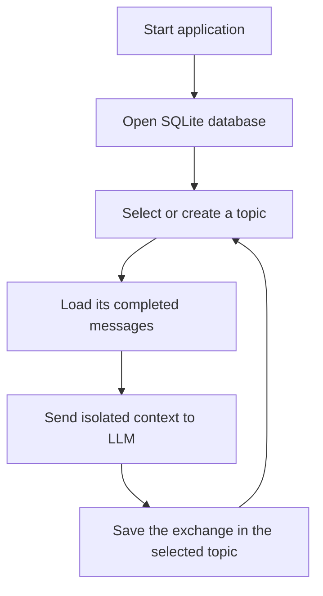

**English** | [Русский](README.ru.md)

# Day 7 — Context Persistence

The seventh assignment adds multiple persistent contexts to the Bublik agent. The user can create a new topic or select a previous dialogue. Its messages are loaded from SQLite and included in the next LLM request.

## Assignment

- store the message history in JSON or SQLite;
- load the history when the agent starts again;
- continue the conversation as if the application had not been stopped;
- verify persistence by restarting the program.

## Result

The agent now keeps several independent topics between process runs. At startup, the CLI displays previous dialogues, lets the user select one or create another, and reports how many messages were restored for the selected topic.

## Structure

```text
day-07-context-persistence/
├── agent.py
├── main.py
├── memory.py
├── README.md
└── README.ru.md
```

- `main.py` provides topic selection, creation, switching, and the dialogue CLI;
- `agent.py` is reused with the selected `conversation_id` and builds its LLM context;
- `memory.py` owns the SQLite schema, conversation list, and message persistence.

## How It Works



The database contains two tables:

- `conversations` stores independent topics and their last activity time;
- `messages` stores its `user` and `assistant` messages.

Every new topic receives a UUID. The same `BublikAgent` class can therefore be reused for any dialogue, while each LLM request receives messages only from the selected `conversation_id`.

Each message has one of three statuses:

- `pending` — the user request was stored before the API call;
- `completed` — the request or response can be included in future context;
- `failed` — the request is retained for diagnostics but excluded from context.

Only the latest 20 completed messages are sent to the model. The complete local history remains in SQLite.

## Run

From the repository root:

```bash
python day-07-context-persistence/main.py
```

The database is created automatically at:

```text
day-07-context-persistence/data/bublik-context.db
```

Local database files are excluded by `.gitignore`.

## Commands

- `/history` — show the history of the current topic;
- `/dialogs` — return to the dialogue selection menu;
- `/exit` or `выход` — finish the program.

## Persistence and Isolation Test

1. Start the program.
2. Create the topic `Исследование Авроры` and tell Bublik:

```text
Чебуратор: Мы назвали обнаруженную планету Аврора-7.
```

3. Enter `/dialogs`, create `Ремонт корабля`, and tell Bublik that the engine needs a new cooling module.
4. Finish the process with `/exit` and start it again.
5. Select `Исследование Авроры` and ask:

```text
Чебуратор: Как мы назвали обнаруженную планету?
```

6. Bublik should answer `Аврора-7` without using facts from `Ремонт корабля`.
7. Switch to `Ремонт корабля` and verify that the engine context is restored independently.

This test verifies both persistence between process runs and isolation between topics.

## Important Detail

The current user request is first stored with the `pending` status. It is added to the API request explicitly because only `completed` messages are restored from the database. After the model answers, the user message is marked as completed and the assistant response is inserted in the same transaction.

This prevents an interrupted or failed request from silently becoming part of the future LLM context.

## Current Limitations

- the context window is limited by message count rather than token count;
- old messages are not summarized;
- there are no embeddings or semantic search;
- SQLite is suitable for a local agent, not a distributed service.

## What I Learned

- persistent memory differs from an in-memory `messages` list;
- a conversation identifier connects messages from different process runs;
- one agent implementation can serve multiple isolated contexts;
- previous dialogues can be sorted by their last activity time;
- startup restoration and prompt construction are separate operations;
- transactional writes keep a user request and assistant answer consistent;
- failed requests should be stored for diagnostics without contaminating context;
- context can be bounded while the complete history remains available.

## Day 7 Outcome

Bublik can now manage several topics, switch between them, stop, start again, and continue any selected dialogue without mixing its context with other conversations.
