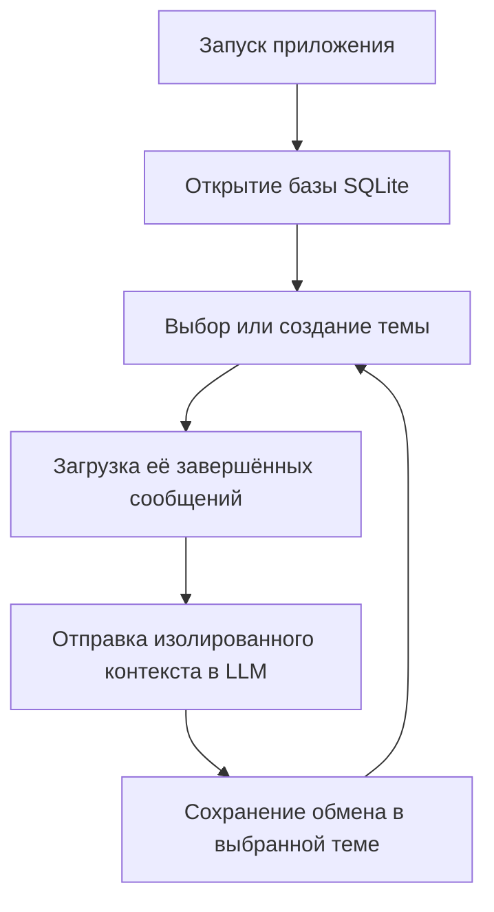

[English](README.md) | **Русский**

# День 7 — сохранение контекста

В седьмом задании агент Бублик получает несколько постоянных контекстов. Пользователь может создать новую тему или выбрать прошлый диалог. Его сообщения загружаются из SQLite и передаются в следующем запросе к LLM.

## Задание

- хранить историю сообщений в JSON или SQLite;
- загружать историю при повторном запуске агента;
- продолжать разговор так, как будто приложение не выключалось;
- проверить сохранение контекста перезапуском программы.

## Результат

Теперь агент сохраняет несколько независимых тем между запусками процесса. При старте CLI показывает прошлые диалоги, позволяет выбрать один из них или создать новый и сообщает количество восстановленных сообщений выбранной темы.

## Структура

```text
day-07-context-persistence/
├── agent.py
├── main.py
├── memory.py
├── README.md
└── README.ru.md
```

- `main.py` предоставляет выбор, создание и переключение тем, а также CLI диалога;
- `agent.py` переиспользуется с выбранным `conversation_id` и собирает его контекст LLM;
- `memory.py` отвечает за схему SQLite, список диалогов и сохранение сообщений.

## Как это работает



В базе находятся две таблицы:

- `conversations` хранит независимые темы и время последней активности;
- `messages` хранит сообщения с ролями `user` и `assistant`.

Каждая новая тема получает UUID. Поэтому один класс `BublikAgent` переиспользуется для любого диалога, а в каждый запрос к LLM попадают сообщения только выбранного `conversation_id`.

Каждое сообщение имеет один из трёх статусов:

- `pending` — запрос пользователя сохранён перед вызовом API;
- `completed` — запрос или ответ можно включать в будущий контекст;
- `failed` — запрос остаётся для диагностики, но исключается из контекста.

Модели передаются только последние 20 завершённых сообщений. Полная локальная история продолжает храниться в SQLite.

## Запуск

Из корня репозитория:

```bash
python day-07-context-persistence/main.py
```

База создаётся автоматически:

```text
day-07-context-persistence/data/bublik-context.db
```

Локальные файлы базы уже исключены через `.gitignore`.

## Команды

- `/history` — показать историю текущей темы;
- `/dialogs` — вернуться к выбору диалога;
- `/exit` или `выход` — завершить программу.

## Проверка сохранения и изоляции

1. Запустите программу.
2. Создайте тему `Исследование Авроры` и сообщите Бублику:

```text
Чебуратор: Мы назвали обнаруженную планету Аврора-7.
```

3. Введите `/dialogs`, создайте тему `Ремонт корабля` и сообщите, что двигателю нужен новый модуль охлаждения.
4. Завершите процесс командой `/exit` и запустите программу снова.
5. Выберите `Исследование Авроры` и спросите:

```text
Чебуратор: Как мы назвали обнаруженную планету?
```

6. Бублик должен ответить `Аврора-7`, не используя факты из темы `Ремонт корабля`.
7. Переключитесь на `Ремонт корабля` и убедитесь, что контекст двигателя восстановлен отдельно.

Такой тест одновременно проверяет сохранение между запусками процесса и изоляцию разных тем.

## Важная деталь

Текущий пользовательский запрос сначала сохраняется со статусом `pending`. В API-запрос он добавляется явно, потому что из базы восстанавливаются только сообщения со статусом `completed`. После ответа модели пользовательское сообщение помечается завершённым, а ответ ассистента добавляется в рамках одной транзакции.

Так прерванный или неуспешный запрос не становится частью будущего контекста LLM.

## Текущие ограничения

- окно контекста ограничивается количеством сообщений, а не токенов;
- старые сообщения пока не суммируются;
- отсутствуют embeddings и семантический поиск;
- SQLite подходит локальному агенту, но не распределённому сервису.

## Что изучено

- постоянная память отличается от списка `messages` в оперативной памяти;
- идентификатор диалога связывает сообщения разных запусков процесса;
- одна реализация агента может обслуживать несколько изолированных контекстов;
- прошлые диалоги можно сортировать по времени последней активности;
- восстановление при запуске и сборка промпта являются отдельными операциями;
- транзакционная запись сохраняет согласованность запроса и ответа;
- ошибочные запросы полезны для диагностики, но не должны загрязнять контекст;
- контекст можно ограничивать, продолжая хранить полную историю.

## Итог седьмого дня

Теперь Бублик может вести несколько тем, переключаться между ними, завершать работу, запускаться снова и продолжать любой выбранный диалог без смешивания его контекста с другими разговорами.
